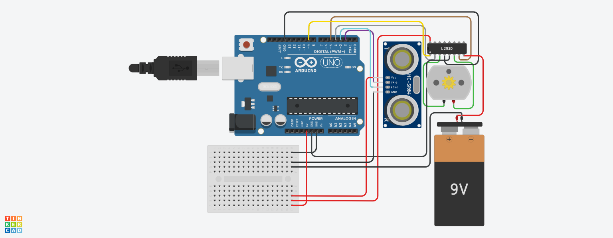

# 🔱 Motorized Mace – Arduino Powered Self-Defense System

This is the official code and documentation for the **Motorized Mace** project — a modern robotic reinterpretation of *Kaumodaki*, the mythological mace of Lord Vishnu.

Built as part of a robotics fest challenge, this project blends **automation**, **electronics**, and **mythological inspiration** to create a self-defense mechanism that activates the moment a threat is detected.

---

## ⚙️ Features

- **Arduino-controlled automated activation**
- **Ultrasonic sensor** detects nearby motion
- **DC gear motor** spins spiked flails rapidly
- **Hands-free defense** — no manual button required
- Inspired by Indian mythology’s most iconic blunt-force weapon

---

## 📦 Components Used

| Component                   | Quantity |
|----------------------------|----------|
| Arduino Nano (or UNO)      | 1        |
| HC-SR04 Ultrasonic Sensor  | 1        |
| L298N or L293D Motor Driver| 1        |
| DC Gear Motor (775/895)    | 1        |
| 12V Battery Pack           | 1        |
| Foam Ball / Flail Head     | 1–2      |
| Toothpicks / Plastic Spikes| 8–10     |
| Chain or Strong Rope       | 2        |
| PVC Pipe / Wooden Rod      | 1        |
| Jumper Wires + Breadboard  | As needed |

---

## 🧠 How It Works

1. The **HC-SR04 ultrasonic sensor** continuously measures distance.
2. If an object is detected within a predefined range (e.g., 50 cm), the Arduino:
   - Triggers the **motor driver**
   - Activates the **DC gear motor**
3. The motor spins a spiked foam ball attached via a chain, simulating a defensive strike.
4. The system is **fully automated** — no switches or manual input required.

---

## 💻 Code

The full Arduino `.ino` file is provided in this repository.

You can adjust:
- **Trigger distance** in centimeters
- **Motor runtime** or behavior
- **Pin assignments** if needed

---

## 📸 Photos & Diagrams

  
  

---

## 🚀 Project by

**Team:** Ananyo, Koustav, Swayambhu  
**School:** Delhi Public School Megacity  
**GitHub Owner:** [UniquePython](https://github.com/UniquePython)

---

## ⚠️ Disclaimer

This project is designed for educational and demonstration purposes. Spiked components should be made from foam or safe material to avoid harm.

---

